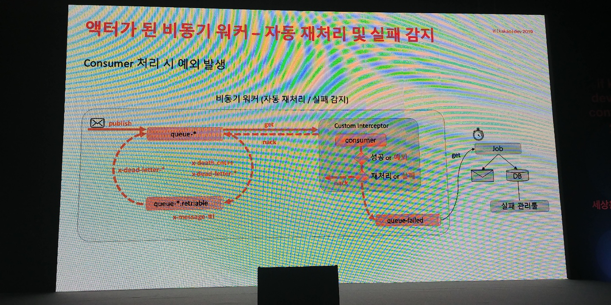

Kakao If 2019
=============
https://if.kakao.com/program

##### 10시
- 키노트
---
##### 11시
- R5, 서버 성능테스트 Tip - 사례를 통해 얻은 교훈들

- ngle 테스트 / 품질 검증 전문 회사
- 카카오게임즈 게임 대부분에 대한 성능 테스트
- 아젠다 :  개요 / 진행사례 교훈 / 더 좋은 테스트를 위해 / 정리

- 개요
    - 진행사례
        - 초급 : 이용자의 다양한 액션 누락
            - 다양한 이용자의 흐름 세분화 및 API별 시나리오 명세 작성
            - 일단 시나리오를 잘 작성한다, 시간정보도 입력
                - 스크립트 상에 sleep도 집어넣어 준다
        - 초급 : 최종 시스템(=라이브 시스템)의 성능 테스트 누락
            - 성능 테스트 망과 실제 부하를 받는 망의 환경이 달랐음
            - 쉬운 일이 아니네, 성능테스트 프로세스를 개선해서 해결 
        - 초급 : 예외 상황에 대한 테스트 누락
            - 로그 서버 죽음 -> API 서버로 장애 전파 -> API서버도 죽음 (당연히...)
            - msa 안해봤나? 
            - 모든 구성 서버들에 대해 예외 상황 테스트 진행
            - 서버 여러대 중 한대를 죽이고 부하 테스트 하는 등..
             - 결론 : autoscaling, failover 테스트도 진행해야 한다.
         - 중급 : Connection을 유지하는 100만 이용자
            - 100만명이 30분동안 커넥션 유지
            - Aws LB(NLB) 넣어서 로드밸런싱 테스트
                - 70만 vuser 인입시 error -> 설정 변경 후 100만 통과 -> clear -> 다음날 다시 하니 안됨 -> 문의 : Pre-Warm-Up 필요함? 답 ㄴㄴ
                - 이는 매일 첫 테스트시에만 발생함 (이상함) 2주 내내 -> AWS 전달 -> Pre-Warm Up 하세요
                - 가이드가 거짓말을 침 -> 참고만 합시다.
        - 중급 : API 검증 실패
            - REST API 테스트하는거 -> 너무 테스트가 잘됨 -> 이상하다? -> 서버가 Mock서버 (헐)
            - 커뮤니케이션 부족으로 발생, 서버 동작 검증시 200만 검증했기 때문
            - -> 데이터 검증 프로세스도 추가 (스크립트에 반영 가능하지 않을까)
        - 고급 : Server Push로 액션이 시작되는 서비스
            - server Push로 액션이 시작되는 웹소켓 서버
            - 봇 클라이언트로 테스트 진행을 했으나 -> 개발자 리소스가 지속적으로 들어감
            - ngrinder의 경우 단일 스레드를 이용한 테스트만 가능함
            - 네티로 공용 I/O스레드를 두고 소켓 열기
        - 고급 : 120개의 봇을 수동으로 실행해야 하는 경우
            - 봇 클라이언트 1개당 500 vuser / 60000 동접 목표 => 120개의 봇 클라이언트
            - ngrinder controller -> agent 에 배치 스크립트 구동하도록 함
            - agent가 봇 클라이언트를 띄울 수 있도록
            - 그러면 agent 120대 띄운건가??
    - 업그레이드 고민
        - 시스템의 기본 성능에 대한 기준을 만들 수 있지 않을까?
            - ex) C4.xlarge는 기본적으로 몇 TPS는 나옵니다.
            - 앱과 아키텍처 구조에 따라 다 다를텐데 이게 가능해?
            - 일단 분류는 열심히 (테스트 결과를 통계화)
        - 테스트 가능 환경의 확장
            - 현재 : webServer, http, ws
            - 앞으로 : webSErver, app, http, ws, tcp 테스트도 가능하도록
    - QNA
        - ngrinder를 쓰는 이유
            - 주로 http 테스트 이용
            - python으로 사용했는데 -> jython쓸 수 있어서
            - 스크립트를 이용한 자유로운 테스트 시나리오 작성
        - aws 과금은?
            - 1대 -> 2대(부하분산) -> 본격 테스트
            - 다수의 인스턴스 -> 스팟 형태로 사용
        - netty서버 자체에도 부하가 갈텐데? 라이브 환경과 달라지지 않는가
            - ??
        - ngrinder 모니터 기능 취약?
            - 개발사에서 제공하는 zabbix 등을 이용해 모니터링
            
            
            
            
            

---
##### 12시
- R3, 초당옥수수의 취소를 막아라! : 수만 건의 주문을 1초내에 처리하는 기술

- 카카오커머스
- 초당옥수수의 비밀 / 레거시 문제점 / 미션 / 액터,비동기 워커 / 배포없이 빠르게 롤백하는 전략 / 판매자 인터뷰

- 초당옥수수의 비밀
    - 옥수수 / 배송 지연
    - 광고
    - 수확 후 바로 배송 / 배송 지연 / 기상(비오면 말려서 수확) 상황에 영향을 받음
    - BL 소개
- 레거시
    - 배송지연 안내 TMS 배치
        - jenkins로 배치 처리해서 발송 (1시간 간격)
        - 주문 몰림 대처가어려움
    - 비즈니스 로직이 복잡
    - 처리 속도 문제
        - 1요청-1스레드, (서블릿 기반이라는 건가?)
- 미션
    - 실시간 TMS 발송
        - 배치 처리 -> 비동기 워커구성 후 처리 (큐잉)
    - 코드 리팩토링
        - 기존 : 요구사항이 계속 늘면서 복잡도 증가, 스파게티화
        - 정리함 -> 구조 단계의 명확화
    - 처리속도 개선
        - 검증 -> 비즈니스 처리 -> TMS 발송
        - 병목 발생 지점 확인 -> 비즈니스 처리
        - 변경 후 : 검증 -> 비즈니스 처리 비동기 워커 -> TMS발송 비동기 워커
        - 변경 후 : 검증 -> 비즈니스 처리 비동기 워커(큐, 컨슈머) -> TMS발송 비동기 워커(큐, 컨슈머)
            - 각각의 워커에서의 메세지는 큐를 통해 전달
- 액터가 된 비동기 워커
    - 분산 처리
        - 큐, 컨슈머 구조
        - 컨슈머 하나가 atomic한 단위로 동작하게 만듦 -> 이후 노드 증설
        - Spring amqp 확장으로 구현(SimpleRabbitListenerContainerFactory)
    - 자동 재처리 및 실패 감지
        - 네트웍 장애 등 일시 장애 상황들이 발생하는 경우
        - 배송은 성격상 서드파티 api 연동이 많음
        - 재처리용 큐를 하나 더 둠 / 실패 메세지 받는 큐를 둠
        - 배치 잡으로 실패 메세지를 주기적으로 db에 저장 / 개발자에게 알림 (이후 개별처리)
    - rabbitmq를 쓰는 이유
        - message header / queue 속성을 잘 쓰기 위해
        - 클러스터 -> 고기용성
    - 구현 (RabbitMQ)
        - 발표자료를 보는 게 나을듯
    - 결론 : 액터 모델 구현
        - 각 비즈니스의 처리 단위가 액터가 되고, 액터는 수평확장이 가능
        - 성능이 많이 좋아졌는가?
            - 그렇다
    - 더 해야할 것
        - 액터 메세지 추적
        - 이거 쉽지 않음 ㅠ
        
- 배포 없이 빠르게 롤백하는 전략
    - zookeeper 이용해서 app에 캐싱 (그 감지하는 코드 집어넣어서)
    - 코드 레벨에서 on/OFF 스위치 이용
    - 그러면 기존 코드 + 새로운 코드가 한 jar에? -> 맞음
- QNA
    - 스위치 질문이 많네
        - true /false 말고 퍼센트로 조절도 가능
    - 메세지가 순간적으로 몰릴때
        - 백프레셔 처리 / 리플레이 기능
        - 10만건정도 까지는 무리 ㄴㄴ 
        - 모든 로그 -> 영구 저장

    
---
##### 14시
- R3, Practical Microservices in gRPC Go feat. GraphQL, Kafka(서포터즈 기사 개발기)

5명? 공동 발표

- 서포터즈 기사 개발
카카오 T 대리 개발
- 당시 상황
    - 외부 영입 인재 다수 / 운영대응 많아짐
    - 뭐 여튼 복잡하다
- 생각 정리하기
    - 생각 정리 -> 짧은 문서 -> 소수 그룹 공유 -> 전체 공유
    - 생각정리 도구로 RFC사용
    - RFC : Requests For Comments : RFC 2616할때 하는 그거
        - 작성해야 하는 필수(?) 항목들이 있음
- 언어
    - java의 장단점 (당시 사용했던 언어)
        - 파트원 선호도 조사 : java 극혐 ㅋ
        - 결론 : go
        - 복잡한 문제의 단순한 해결책 찾기
        - go의 장점 다수 (발표자료 참고)
        - 의존성 주입
            - FX라는 라이브러리(?) 로 해결
- 서비스 구조
    - 기존
        - R/R로 monolith 형태로 구현
        - 레거시임, 여기에 새로운 개발 product를 올리기 쉽지않음
    - MSA / 장점 / 단점
- 서비스 계층
    - REST Api보다 GRPC
        - 성능
        - GRPC UI 이용해서 테스트
    - IDL Registry
- 테스트
    - 부하테스트 
        - ghz : grpc
        - ngrinder : http
    - 통합테스트
        - docker-compose로 묶어서 실행
        - postman으로 테스트 스크립트 작성

- Kafka
    - 발표자료 보면 충분
    - 1 event produce & multi consumer group (서비스가 알아서 필요한 메세지 소비)
    - 장애가 나더라도 실패 지점부터 재실행 가능
    - 메세지 버전 관리 도입 (이건 좀 궁금하다)
    
- API Gateway
    - 다수의 API 서비스
    - 앞단에 Gateway 두기
    - GraphQL 도입
        - 단일 endpoint를 두고 쿼리 작성해서 보냄
        - bk 발표를 보면 도움이 됩니다.
        - go node.js java로 프로토타이핑을 해봄
        - node가 제일 괜찮고 짧은 코드
        - 제공해주는 별도 미들웨어 레이어
        
- 서비스 모니터링
    - 서비스 장애로 오픈하고 얼마안되서 롤백
    - 장애발생 : 피크타임에 기능 추가했기 때문
    - 출시일 이후에 모니터링을 도입해야 하는 상황
    - 빠른 적용이 가능한 Prometheus / Grafana 도입
    - Prometheus
        - 오픈소스 메트릭 수집 도구
        - Pull 방식, 컨테이너 최적화
    - 장애 원인은?
        - MSA 제품군 중 하나가 staging 서버를 보고 있었음(사양이 낮음)
        - helm으로 묶어서 배포해야되나
    - Zipkin으로 트레이싱 구성
        - Zipkin이 문제가 아니라 
    
- 레거시
   - 엔커뮤니티 할때 했던 방식대로 함
   - 소프트웨어 레벨에서 트래픽을 점진적으로 신서버로 이전 (트래픽 스로틀링)
   
        
- **굳이 기록하지 않고 발표자료 한번 읽는 게 나을듯 함**
    

---
##### 15시
- R2, Airflow를 활용하여 아름다운 데이터 파이프라인 구성하기
카카오페이지

- 데이터 분석 문제 / 워크플로우 관리 시스템 / 시연 / 아키텍처 / 활용

- 2014년 -> 2019년 5년 동안 100배 성장
- 이런 우상향 성장이 계속 진행되면 데이터 분석이 점점 어려워짐

- 데이터 분석 문제
    - 개발 조직 분화
    - 서비스 : 카카오페이지 / 다음웹툰
        - 회원 / 결제 / 콘텐츠 / 운영 / 정산 /광고 / 데이터플랫폼
        - -> MSA 아키텍처
    - MSA로 분화되면 데이터 분석이 어렵다
        - 서로 다른 데이터베이스간의 조인을 어떻게 : ? 크로스 데이터베이스 조인 이슈
        - -> 데이터 레이크 / 데이터 웨어하우스 (DW)
        - -> 흩어져있는 데이터가 한군데 모이는 공간 (HDFS / S3) 스토리지 / Hive / Spark / Impala / Presto (엔진)
        - 몽땅 hdfs에 때려넣자 + 가공도 해서 때려넣자
        - 분석가 입장에서는 데이터레이크만 보면 된다
        - 이걸 Airflow로 한다
        
- 워크플로우 관리 시스템
    - Apache Airflow
        - 워크플로우 플랫폼
        - 에어비앤비에서 개발
        - GCP에서도 : Cloud Composer
        - 워크플로우 시스템 (이거 말고도)
            - 250개 넘음
            
        - 워크플로우 ? 
            - 작업
                - 수집 / 정제 / 리포팅 등
            - 작업간 의존성이 있음
            - 두개를 합쳐서 워크플로우
                - 문과스러운 단어 
                - 이과스럽게 : DAG : Directed Acyclic Graph
            - DAG 형태대로 순차 실행
            - 모든 작업은 ASAP으로 종료
                - 중간에 작업이 실패하면
                    - 연관성 없는것은 계속 실행
                    - 실패한것을 재실행 하면 -> 나머지도 이어서 실행됨
                    
    - 왜 Apache Workflow를 선택했는가?
        - 아즈카반 / 오지(Oozie) / 에어플로우 / 루이지
        - 아즈카반 
            - 작성 압축 업로드 
            - 작성시 별도 스크립트
            - -> 탈락
        - 루이지
            - 태스크 트리거링 (크론탭에 의존) -> 탈락
        - 오지 / 에어플로우 남음
            - 오지가 더 오래됨   
            - 에어플로우가 더 기여자 / 커밋 수가 많음 (역사는 더 짧음)
            - XML vs Python Code
            - Hue/ Plugin vs Rich UI (Gui가 강함)
            - Web service api / Experimental (Rest API 지원 여부)
            - 고가용성 / Spof: Scheduler
        - Airflow
            - Dag 표현방식 / 기여자 수
            - UI / 확장성이 좋아서 선택
            
- 어떻게 쓰는가?
    - 영상으로 확인
    
- 아키텍처
    - 스케줄러
        - 실행 주기가 되면 작업 생성
        - 의존하는 작업이 모두 성공하면 브로커에
    - 브로커
        - 실행가능한 작업들이 들어가는 공간
    - 워커
        - 실제 작업을 하는 주체
    - 메타DB
        - DAG /Task 정의
    - 다들 보면 SPOF가 됨
    - HA 구성
        - 그림 참조
        - HA Broker 구성
        - 메타 DB : Master / Slave
        - 그래도 Scheduler는 SPOF
            - Failover Controller 를 두고 Active /Standby로 구성
            - 공식 지원은 아님
            
- 활용 
    - 그림 참조
    - 물리 / VM장비를 섞어서 워커 구성
    - 데이터 레이크 구성
        
        - 1. Pool and Priority Weight
            - db도 많고 / 안에 테이블 수도 많다
            - 동시성 한계치 제어
            - Pool 안에서 실행 순서 제어
            - Pool
                 - 동시성 제어
                 - 정해준 슬롯 개수만큼 동시에 실행
             - Weight
                - 태스크마다 Weight설정, 높을수록 우선순위가 높음
            - Pool 활용 방법
                - 용량이 작은 테이블 그룹 / 용량이 많은 그룹
                - 그룹별로 풀 사이즈를 다르게 설정
                -  수 많은 테이블들을 적절한 부하를 유지하면서 병렬적으로 불러오기 위해 사용
                
        - 2. Worker 역할 분리 문제
            - R이 돌아가면 Impala / Spark 에 영향
            - 브로커에서 큐를 네이밍 / 분리 가능 (Default Queue / R Queue)
            - airflow.cfg수정으로 큐 이름 변경
            - -q 옵션으로 큐 지정
            - task 생성시 queue 파라미터 지정
            - 부하 / 보안문제로 워커를 분리하는 경우 큐를 잘 쓰자
            
        - 3. 너무 거대한 DAG 의존관계는 어떻게 관리하나?
            - 그대로 놔두고, 의존 관계가 필요하면 DAG를 새로 만든다
            - 센서 : 
                - 특정 조건이 채워지기를 기다리는 Operator
                - ExternalTaskSensor
                    - DAG1 : 엄청나게 큼
                    - 센서를 이용해 별도의 DAG를 만듦

---
##### 16시
- R2, 광고 데이터 처리 시스템 소개

---

